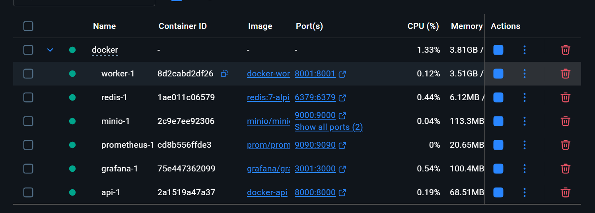

# Projet Fil Rouge IA Cloud : Transcript Service

_Projet M2 : "Industrialisation de l'IA dans le cloud" -> Transcription Media as a Service_

## 1. Objectif & Description
Ce projet implémente un service de transcription multimédia scalable permettant :
- Upload de vidéos ou audio
- Transcription automatique via IA (Whisper)
- Génération de sous-titres

- Génération de vidéos avec sous-titres
- Traitement asynchrone par queue
- Monitoring temps réel
- Dashboard admin
- Accélération GPU
- Architecture micro-services dockerisée
Le système simule une architecture de production avec :
- API REST (FastAPI)
- Worker asynchrone
- Queue Redis
- Stockage objet MinIO
- Monitoring Prometheus + Grafana (Admin)
- UI utilisateur

## 2. Stacks 
**Backend :**
- Python 3.12
- FastAPI
- PyTorch
- Whisper ASR
- Redis
- MinIO S3

**IA/GPU :**
- Whisper medium (OpenAI)
- CUDA
- GPU Acceleration (RTX 3050 Laptop)

**Monitoring :**
- Prometheus
- Grafana
- Metrics calculées avec Python

**Infra :**
- Docker
- Nvidia Container Toolkit

## 3. Features 
**Upload :**
- MP4/WAV/MP3
- Validation type input
- Stockage MinIO

**Traitement :**
- Queue Redis
- Worker daemon (Python)
- Job steps :
    - uploaded
    - queued
    - running
    - succeeded/failed

**Outputs :**
- transcript_text
- subtitles_srt
- video_embedded
- video_with_subtitle_track

**GPU :**
- PyTorch CUDA-
- Traitement accéléré

**Monitoring :**
- Jobs running
- Jobs queued
- Success / failure
- GPU memory usage
- Job duration

**Admin :**
- Dashboard Grafana autoprovisionné (Prometheus)

**UI :**
- Upload fichier
- Choix outputs
- Polling job status
- Download résultats

## 4. Installation
> Prérequis : 
- Docker Engine running 

> Via ./Docker : 
```bash
docker compose up -d --build
```
```bash
docker ps
```
-> 

> Consultation :
- UI : http://localhost:8000/ui (user)
- API : http://localhost:8000/docs (debug)
- MinIO : http://localhost:9001
- Prometheus : http://localhost:9090 (cacher par sécurité ?)
- Grafana : http://localhost:3001 (admin lock)

## 5. Structure 
```txt
README.MD
requirements.api.txt
requirements.worker.txt
pytest.ini
.dockerignore
.gitignore

app/
  __init__.py
  main.py
  media_rules.py
  storage.py
  static/
    app.js
    index.html
    style.css

pipeline/
  __init__.py
  processor.py
  transcription.py
  audio.py
  video.py
  subtitles.py
  packaging.py

worker/
  worker.py
  metrics.py
  queue.py
  submit_job.py
  
test/
  test_processor.py
  test_api.py
  conftest.py

docker/
  docker-compose.yml
  api.Dockerfile
  worker.cpu.Dockerfile # pas utilisé atm
  worker.gpu.Dockerfile
  grafana/provisioning/
    dashboards/
      dashboard.yml #admin
      /json
          transcription-dashboard.json
    datasources/
        prometheus.yml
  prometheus/
    prometheus.yml
  ```